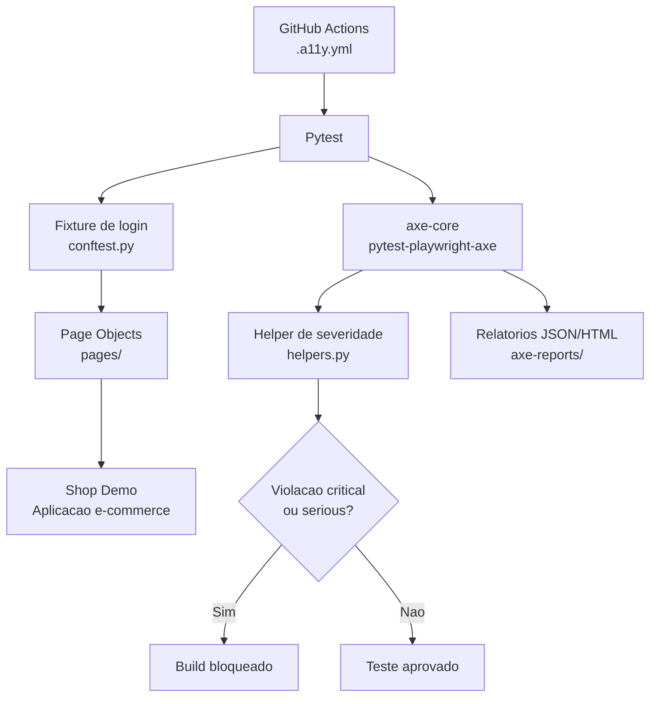

# Playwright Axe Core

[](https://github.com/rafarfelipe/playwright-axe-core/actions/workflows/a11y.yml) [](https://www.python.org/) [](https://playwright.dev/python/) [](https://docs.pytest.org/) [](https://www.deque.com/axe/) [](https://www.nvaccess.org/)

> Projeto prático de testes de acessibilidade com Playwright, Pytest e axe-core aplicado a um e-commerce real.

## Sobre o projeto

Este repositório acompanha um curso prático sobre automação de acessibilidade dentro de uma arquitetura de testes moderna. A proposta é usar ferramentas que QAs, testers e desenvolvedores já utilizam no dia a dia para testar fluxos funcionais e transformá-las em uma estratégia contínua de qualidade inclusiva.

O projeto configura o `axe-core` com Playwright e Pytest, organiza os fluxos com fixture de login, helper de assertions por severidade e Page Object Model, e executa os scans contra o [Shop Demo](https://jefersoncaye.github.io/shopdemo-web/).

## Status do projeto

O projeto está ativo como material prático de estudo e demonstração. Os testes executam scans reais contra o e-commerce usado no curso e já identificam violações de acessibilidade como `button-name`, `color-contrast`, `link-in-text-block` e outras regras do axe-core. Essas falhas são intencionais no cenário didático para exercitar leitura, priorização e correção de problemas.

## O que você aprende

- Configurar e executar o axe-core integrado a Playwright e Pytest.
- Organizar testes com fixtures, helpers e Page Objects.
- Executar scans em uma página inteira ou em um componente específico.
- Incluir e excluir regras conforme a estratégia de cada fluxo.
- Ler relatórios JSON e HTML e priorizar problemas por impacto.
- Identificar problemas reais de contraste, heading, landmark, links e botões.
- Reconhecer os limites da automação com testes de teclado e leitor de tela usando NVDA.
- Criar um gate de acessibilidade no GitHub Actions.

## Arquitetura

O projeto separa responsabilidades entre configuração, Page Objects, cenários de teste, análise de acessibilidade e integração contínua:



### Responsabilidades

| Camada               | Responsabilidade                                                                             |
| -------------------- | -------------------------------------------------------------------------------------------- |
| `conftest.py`        | Abre o e-commerce e autentica o usuário por meio de fixture reutilizável.                    |
| `pages/`             | Encapsula navegação e interações dos fluxos com Page Object Model.                           |
| `test/`              | Define os cenários de acessibilidade de catálogo, produto, carrinho, checkout e confirmação. |
| `helpers.py`         | Filtra violações por impacto e falha o teste para severidades críticas ou sérias.            |
| `.github/workflows/` | Instala dependências, navegadores, executa o gate e publica artefatos.                       |

## Estrutura do projeto

```text
playwright-axe-core/
├── .github/
│   └── workflows/
│       └── a11y.yml                 # Gate de acessibilidade no GitHub Actions
├── pages/                            # Page Objects dos fluxos do e-commerce
│   ├── carrinho_page.py
│   ├── catalago_page.py
│   ├── checkout_page.py
│   ├── confirmacao_page.py
│   └── produto_detalhe_page.py
├── test/                             # Cenários de acessibilidade por fluxo
│   ├── test_a11y_carrinho.py
│   ├── test_a11y_catalogo.py
│   ├── test_a11y_checkout_pagamento.py
│   ├── test_a11y_confirmacao.py
│   └── test_a11y_produto_detalhe.py
├── conftest.py                       # Fixture de login
├── helpers.py                        # Assertion por severidade
├── pytest.ini                        # Configuração do pytest e URL base
├── requirements.txt                  # Dependências Python
└── test_primeiro_scan.py             # Primeiro scan e geração de relatórios
```

## Pré-requisitos

- Python 3.12 ou superior
- Git
- Navegador Chromium instalado pelo Playwright

## Instalação

### Windows PowerShell

```powershell
python -m venv venv
.\venv\Scripts\Activate.ps1
python -m pip install --upgrade pip
pip install -r requirements.txt
playwright install chromium
```

### Linux ou macOS

```bash
python3 -m venv venv
source venv/bin/activate
python -m pip install --upgrade pip
pip install -r requirements.txt
playwright install --with-deps chromium
```

## Executando os testes

Executar todos os testes:

```bash
pytest -v -o addopts=""
```

Executar somente os testes de acessibilidade:

```bash
pytest -k a11y -v -o addopts=""
```

Executar um cenário específico:

```bash
pytest test/test_a11y_catalogo.py -v -o addopts=""
```

O `pytest.ini` usa `--headed` por padrão para facilitar o acompanhamento local. O parâmetro `-o addopts=""` desativa esse comportamento quando a execução precisa ser headless, como no GitHub Actions.

## Relatórios

O teste inicial demonstra a geração dos formatos JSON e HTML:

```python
axe = Axe(output_directory="axe-reports")
resultado = axe.run(
    page,
    filename="mars_scan",
    html_report_generated=True,
    json_report_generated=True,
)
```

Os arquivos são gravados em `axe-reports/`. Esse diretório é ignorado pelo Git e pode ser publicado como artefato da pipeline.

## Gate no GitHub Actions

O workflow em `.github/workflows/a11y.yml` é executado a cada `push` na branch `main` e:

1. Instala Python 3.12.
2. Instala as dependências do projeto.
3. Instala o Chromium com as dependências do sistema.
4. Executa os testes de acessibilidade.
5. Publica `axe-reports/` como artefato mesmo quando algum teste falha.

O helper `assert_sem_violacoes_graves` considera `critical` e `serious` como bloqueadores do build. Violações de menor impacto podem ser analisadas e priorizadas sem interromper o gate.

## Escopo da automação

O axe-core é excelente para detectar muitos problemas baseados no DOM, mas não substitui testes manuais. A estratégia completa também deve verificar:

- Navegação integral por teclado.
- Ordem e visibilidade do foco.
- Uso com leitor de tela, incluindo testes práticos com o NVDA.
- Mensagens de erro e instruções compreensíveis.
- Fluxos reais, como a manutenção do foco após finalizar uma compra.

## Tecnologias

- [Python](https://www.python.org/)
- [Pytest](https://docs.pytest.org/)
- [Playwright for Python](https://playwright.dev/python/)
- [pytest-playwright](https://github.com/microsoft/playwright-pytest)
- [pytest-playwright-axe](https://pypi.org/project/pytest-playwright-axe/)
- [axe-core](https://github.com/dequelabs/axe-core)
- [NVDA](https://www.nvaccess.org/download/)
- [GitHub Actions](https://docs.github.com/actions)

## Autor

**Rafael Felipe**

[](https://www.linkedin.com/in/rafaelrfelipe/)
